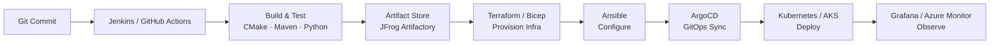

# 👋 Hi there, I'm **Penchalaiah Jammula**
### Senior DevOps Engineer | Build & Platform Engineering | IaC, CI/CD & GitOps Specialist

  

---

### 🚀 Professional Summary

**Senior DevOps Engineer** with **16+ years** of combined experience in DevOps engineering, build & platform engineering, and embedded software integration for the automotive and industrial sectors. Specialized in **Infrastructure as Code** (Terraform, Bicep, Ansible), **multi-cloud platforms** (AWS, Azure, GCP) and **CI/CD pipelines** (Jenkins, GitLab CI/CD, GitHub Actions, Azure DevOps) that automate build, test and deployment across Linux and Windows environments. Proven track record designing containerized development/test platforms (Docker, Kubernetes), driving GitOps and IaC adoption, and troubleshooting complex build, infrastructure and embedded systems issues. Combines classic DevOps/Platform Engineering skillsets with strong build-chain and test-automation expertise (CMake, Maven, Python, Shell/PowerShell) — supporting both application and embedded/build-system delivery pipelines end-to-end.

📍 Based in **Tuttlingen, Germany** &nbsp;·&nbsp; 🟢 **Available in 1 Month** &nbsp;·&nbsp; 🇩🇪 **German: B2** &nbsp;·&nbsp; 🪪 **Niederlassungserlaubnis** &nbsp;·&nbsp; 🌍 **Nationality: Indian**

🔗 [LinkedIn](https://www.linkedin.com/in/penchaljammula/) &nbsp;|&nbsp; ✉️ penchal.jammula@gmail.com &nbsp;|&nbsp; 📞 +49 15510020160

---

### 🔭 Currently

- 🏗️ Working on **BMS DevOps platform automation** — multi-cloud CI/CD & GitOps for Battery Management Systems at Marquardt GmbH.
- 🌱 Deepening expertise in **platform engineering & internal developer platforms (IDPs)**.
- 💬 Ask me about: **Terraform, Ansible, Jenkins/GitLab pipelines, ArgoCD/GitOps, Kubernetes, or build-chain automation (CMake, Python)**.
- 🎯 Open to **Senior/Lead DevOps, Platform Engineering, and Cloud Infrastructure roles** — immediate to 1-month availability.

---

### 🧰 Technical Toolbox

| Category | Tools & Technologies |
|---|---|
| **Cloud Platforms** |    |
| **Infrastructure as Code** |    |
| **CI/CD & GitOps** |      |
| **Containers & Orchestration** |    |
| **Build & Test Automation** |    |
| **Languages & Scripting** |        |
| **Monitoring & Troubleshooting** |    |
| **Embedded & Automotive Tools** |      |
| **Artifact & Collaboration** |     |

---

### 🔧 A Typical Pipeline I Build

*Version-controlled, repeatable, and auditable — from commit to production, across Linux & Windows environments.*

---

### 💼 Experience Snapshot

| Company | Role | Period | Focus |
|---|---|---|---|
| **Marquardt GmbH** (Rietheim, DE) | Senior SW Engineer — DevOps & Platform Engineering (BMS) | 09/2019 – Present | Multi-cloud CI/CD, GitOps, IaC, containerized build/test platforms |
| **ZF TRW / Valeo** (Germany) | Software Engineer & Integrator — DevOps-Driven Test Automation (ADAS) | 07/2016 – 06/2019 | Jenkins CI/CD, CAPL/Python test automation, HIL testing |
| **FEV GmbH** (Aachen, DE) | Software Developer & Integrator — Power Transmission Systems | 11/2015 – 05/2016 | Python/Bash automation, CI/CD pipeline steps, calibration tooling |
| **Delphi / Continental Automotive** (Bangalore, IN) | Senior SW Engineer / Function Development Owner — ADAS | 09/2011 – 10/2015 | AUTOSAR, safety-critical modules, XCP/CAN protocols |
| **One Convergence / Sugan Automatics** (Hyderabad, IN) | Embedded Systems / Driver Development & Test Engineer | 03/2009 – 09/2011 | Firmware, driver development, test automation frameworks |

---

### 💼 Key Projects

- 🏭 **BMS DevOps Platform** @ Marquardt — Designed multi-cloud (AWS/Azure) CI/CD pipelines with Jenkins & GitLab CI/CD, and drove GitOps deployment practices using ArgoCD.
- 🧱 **Infrastructure as Code Rollout** — Built and maintained Terraform & Bicep modules for repeatable, auditable infrastructure provisioning; automated configuration with Ansible.
- 🐳 **Containerized Build/Test Platforms** — Delivered Docker & Kubernetes-based build/test environments across Linux and Windows for development and self-hosted CI agents.
- 🚘 **ADAS Test Automation** — Built Python/CAPL/Bash test-automation frameworks integrated into Jenkins pipelines for Forward Camera and Laser Scanner systems.

---

### 🎓 Certifications & Education

  
  &nbsp;&nbsp;
  

  
  &nbsp;
  

  
  &nbsp;
  

**🎓 Academic Background**
- **MBA — Business Management**, NMIMS, Mumbai, India (2019 – 2021)
- **Post-Graduate Diploma — Embedded Systems Design & Development**, C-DAC, Hyderabad, India (2008 – 2009)
- **B.Tech — Electrical & Electronics Engineering**, Narayana Engineering College, Nellore, India (2004 – 2008)

---

### 📈 GitHub Stats

---

### 💡 How I Work

I believe infrastructure should be as testable, reviewable, and version-controlled as application code. My approach blends classic DevOps discipline with a build-engineer's attention to reproducibility — whether that's a Terraform module, a Jenkins pipeline, or an embedded build chain.

---

*Passionate about building reliable, automated, and scalable DevOps & platform engineering solutions.*

📞 +49 15510020160 &nbsp;|&nbsp; ✉️ [penchal.jammula@gmail.com](mailto:penchal.jammula@gmail.com) &nbsp;|&nbsp; 🔗 [LinkedIn](https://www.linkedin.com/in/penchaljammula/)

